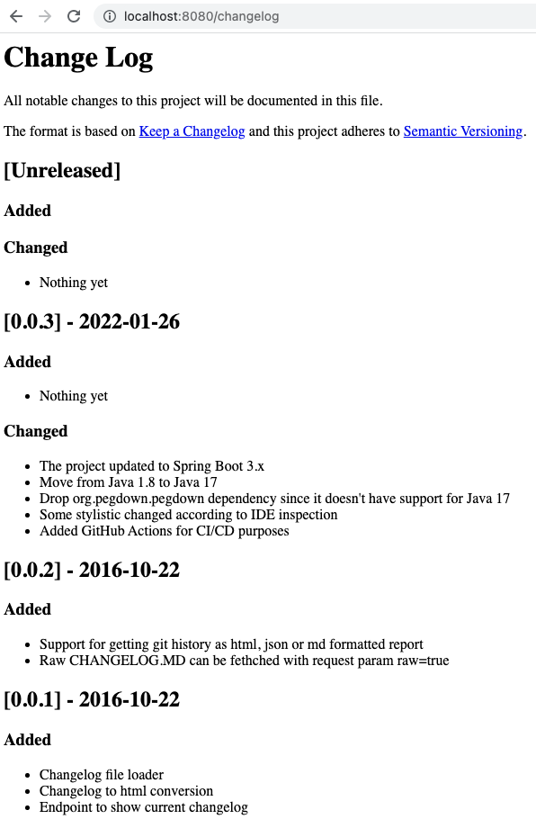

#Spring Boot Change Log

Example spring boot application that offers endpoints to get project CHANGELOG.MD file and the git history reports via HTTP endpoints
 
Exposes ```/changelog``` endpoint to view the contents of the CHANGELOG.MD file as a html page.

Exposes ```/changelog/git``` endpoint to view the contents of the git history exported to html, json and md files at build time. 

Has maven resources plugin configured to copy CHANGELOG.MD file from the standard root location to the build target directory to make it available in the classpath.

Uses gitlog-maven-plugin to export git history to html, json and md formatted reports at build time.

Path to CHANGELOG.MD file can be configured with a ```changelog.path``` application property.
Path to git history reports can be configured with a ```git.logs.path``` application property

### Example of default changelog endpoint
